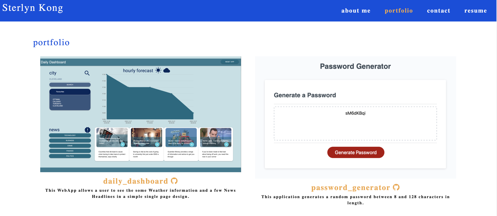

# react_portfolio
  

  ## Description:
  A sample portfolio built using react (first attempt)

  ## Technologies
  - React
  - NodeJS
  - HTML
  - CSS


  ## Table of contents:
  * [Installation](#installation)
  * [Usage](#usage)
  * [License](#license)
  * [Tests](#testing)
  * [URL](#url)
  * [Screen-Shot](#image)
  * [Contributing](#contributing)
  * [Questions](#questions)


  ## Installation:
  To install necessary dependencies, run the following command(s):

  ```
  npm i
  ```


  ## Usage:
  
* [License](#license)


  ## License
  This project is licensed under the GPL_3.0 license.


  ## Testing:
  To run test, please run the following command:

  ```
  
  ```


  ## URL:
  https://sterlynkong.github.io/react_portfolio/


  ## Image:
  


  ## Contributing:
  Contact via GitHub or email for permission to contribute!


  ## Questions:
  If you have any questions about the repo, please open an issue or contact me directly at youngancient@live.com. You can view more of my projects at [SterlynKong](https://github.com/SterlynKong).
